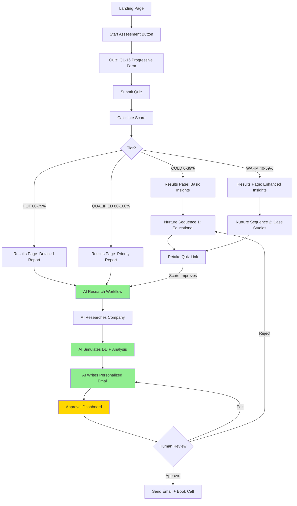

# Phase 1 Implementation Plan
## Help Desk Process Improvement Assessment for Timeless Technology Solutions

**Date:** November 5, 2025
**Status:** Foundation Complete - Ready for UI Development
**Completion:** Database Schema ✅ | Quiz Design ✅ | Migration ✅ | Seed Data ✅

---

## ✅ Completed: Database Foundation

### New Tables Created

1. **`quiz_questions`** - Stores assessment questions (16 questions seeded)
2. **`quiz_responses`** - Individual lead answers to each question
3. **`lead_scores`** - Calculated readiness & qualification scores
4. **`email_sequences`** - Nurture email templates by tier
5. **`email_sends`** - Tracks all email sends with status

### Quiz Questions Seeded (16 Total)

**Max Possible Score:** 699 points

**Scoring Tiers:**
- **COLD (0-39%):** 0-272 points → Nurture Sequence 1
- **WARM (40-59%):** 279-412 points → Nurture Sequence 2
- **HOT (60-79%):** 419-552 points → AI Research Workflow
- **QUALIFIED (80-100%):** 559-699 points → Priority AI Research + Outreach

### Question Breakdown

**Section 1: Contact & Company (Q1-3)** - Qualification Baseline
- Q1: Contact info (name, email, company, title)
- Q2: Company size (5-20 points)
- Q3: Industry (5-15 points, healthcare/finance/tech score highest)

**Section 2: Help Desk Current State (Q4-8)** - Pain & Scale Assessment
- Q4: Help desk team size (5-20 points, weighted 2x)
- Q5: Monthly ticket volume (3-25 points, weighted 2x)
- Q6: Ticketing system (DDIP compatibility flagged, weighted 1x)
- Q7: Pain points (multi-select, 5-10 points each, weighted 2x)
- Q8: Current metrics tracking (3-15 points)

**Section 3: Goals & Strategic Fit (Q9-11)** - Sophistication Signals
- Q9: Primary goal (12-20 points, "strategic insights" scores highest, weighted 2x)
- Q10: Historical data available (5-25 points, **weighted 3x** - critical for DDIP)
- Q11: Previous improvement attempts (5-18 points, "failed attempts" = high motivation)

**Section 4: Readiness Indicators (Q12-14)** - Buying Signals
- Q12: Decision authority (3-25 points, **weighted 3x**)
- Q13: Timeline (3-30 points, **weighted 3x**)
- Q14: Budget range (3-30 points, **weighted 3x**)

**Section 5: Qualitative Insights (Q15-16)**
- Q15: Biggest obstacle (text, no scoring - for personalization)
- Q16: Cross-departmental insights wanted (multi-select, 5-8 points each)

---

## 📋 Value Proposition & Positioning

### For Timeless Technology Solutions' DDIP Offering

**Landing Page Headline:**
"Is Your Help Desk Costing You More Than It Should?"

**Subheadline:**
Take our free 5-minute Help Desk Health Assessment and discover:
- Hidden inefficiencies in your support operation
- Opportunities for cost savings and faster resolution
- Data-driven insights to improve your entire organization

**The DDIP Connection:**

This assessment is the **gateway to DDIP services**. For leads scoring 60%+, the AI research workflow will:

1. **Research the company** (size, industry, tech stack, recent news)
2. **Simulate DDIP analysis** based on quiz responses
3. **Write personalized email** showing what DDIP would discover in their help desk

**Example Personalization (HOT Lead - 65% score):**

> Hi [Name],
>
> Thanks for completing the Help Desk Health Assessment. You scored 65% - indicating significant improvement opportunities.
>
> **What caught my attention:**
> - 1,000+ monthly tickets in healthcare (high-stakes environment)
> - Using ServiceNow (rich data source for DDIP)
> - "Same issues keep recurring" + "Can't identify root causes"
> - 12-18 months of ticket history available
> - Timeline: 1-3 months
>
> **What DDIP would likely discover:**
>
> In similar healthcare help desks with this profile, our Data-Driven Insights Platform typically uncovers:
>
> 1. **30-40% of tickets are preventable** - 3-5 recurring root causes that upstream fixes could eliminate
> 2. **Knowledge gaps** - Specific software or processes generating disproportionate tickets
> 3. **Cross-departmental insights** - Help desk patterns revealing broader issues (onboarding gaps, training needs, deployment problems)
>
> **The DDIP Process:**
> - Extract & cleanse 12-18 months of ServiceNow data
> - Analyze structured + unstructured data (ticket descriptions, resolutions)
> - Identify root causes with source-referenced validation
> - Deliver strategic roadmap with ROI projections
>
> Worth a 30-minute strategy call this week?
>
> [Calendar Link]

---

## 🎯 Next Steps: UI Development

### Immediate Priorities (This Week)

**1. Landing Page** - [app/assessment/page.tsx](app/assessment/page.tsx)
- Hero section with headline + subheadline
- Trust indicators (social proof, typical results)
- "Start Assessment" CTA button
- Responsive design

**2. Quiz Interface** - [app/assessment/quiz/page.tsx](app/assessment/quiz/page.tsx)
- Progressive form (one question at a time)
- Progress bar (Question X of 16)
- Question types:
  - `contact_info`: Multi-field form
  - `multiple_choice`: Radio buttons
  - `checkbox`: Multi-select checkboxes
  - `text`: Text area input
- Validation before proceeding
- Back/Next navigation
- Auto-save progress (localStorage)

**3. Scoring Logic** - [lib/scoring.ts](lib/scoring.ts)
```typescript
interface ScoringResult {
  totalPoints: number;
  maxPossiblePoints: number;
  readinessScore: number; // 0-100 percentage
  tier: 'cold' | 'warm' | 'hot' | 'qualified';
  breakdown: {
    contactInfo: number;
    currentState: number;
    goals: number;
    readiness: number;
  };
}

function calculateScore(responses: QuizResponse[]): ScoringResult
```

**4. Results Page** - [app/assessment/results/[leadId]/page.tsx](app/assessment/results/[leadId]/page.tsx)
- Dynamic content based on tier
- Score visualization (circular progress)
- Personalized insights
- Next steps CTA:
  - **COLD/WARM:** "Get Free Resources" (email capture for nurture)
  - **HOT/QUALIFIED:** "Book Strategy Call" (calendar link)

---

## 📊 Complete Lead Flow



---

## 🛠️ Technical Implementation Tasks

### Week 1: Core Quiz Experience

**Day 1-2: Landing Page**
- [ ] Create [app/assessment/page.tsx](app/assessment/page.tsx)
- [ ] Hero section with compelling copy
- [ ] Social proof section (testimonial placeholder)
- [ ] CTA button linking to `/assessment/quiz`
- [ ] Mobile responsive

**Day 3-5: Quiz Interface**
- [ ] Create [app/assessment/quiz/page.tsx](app/assessment/quiz/page.tsx)
- [ ] Fetch quiz questions from database
- [ ] Build question renderers:
  - [ ] ContactInfoQuestion component
  - [ ] MultipleChoiceQuestion component
  - [ ] CheckboxQuestion component
  - [ ] TextQuestion component
- [ ] Progress bar component
- [ ] Navigation (back/next/submit)
- [ ] Form validation
- [ ] LocalStorage auto-save

**Day 6-7: Scoring & Results**
- [ ] Create [lib/scoring.ts](lib/scoring.ts) with scoring logic
- [ ] API route: [app/api/assessment/submit/route.ts](app/api/assessment/submit/route.ts)
  - [ ] Save quiz responses
  - [ ] Calculate score
  - [ ] Save lead score
  - [ ] Determine tier
  - [ ] Trigger workflow (if HOT/QUALIFIED)
- [ ] Create [app/assessment/results/[leadId]/page.tsx](app/assessment/results/[leadId]/page.tsx)
  - [ ] Fetch lead score
  - [ ] Dynamic content by tier
  - [ ] Score visualization
  - [ ] CTA based on tier

---

### Week 2: AI Workflow Integration

**Day 8-9: Workflow Trigger**
- [ ] Update [workflows/inbound/index.ts](workflows/inbound/index.ts)
  - [ ] Accept quiz responses as input
  - [ ] Access scoring breakdown
  - [ ] Pass context to AI research agent

**Day 10-11: Enhanced AI Prompts**
- [ ] Update research agent in [lib/services.ts](lib/services.ts)
  - [ ] Prompt: "Simulate DDIP analysis for this help desk"
  - [ ] Reference specific quiz answers
  - [ ] Focus on DDIP value proposition
- [ ] Update email generation prompt
  - [ ] Personalize with quiz answers
  - [ ] Highlight DDIP capabilities
  - [ ] Include sample insights

**Day 12-14: Approval Dashboard V1**
- [ ] Create [app/dashboard/leads/page.tsx](app/dashboard/leads/page.tsx)
  - [ ] Table of pending leads
  - [ ] Show score, tier, company
  - [ ] Link to detail view
- [ ] Create [app/dashboard/leads/[id]/page.tsx](app/dashboard/leads/[id]/page.tsx)
  - [ ] Tabs: Overview | Quiz Responses | Research | Email Draft
  - [ ] Action buttons: Approve | Edit | Reject
  - [ ] Edit email inline
- [ ] API routes for approve/reject/edit

---

### Week 3: Email Nurture System

**Day 15-16: Email Sequences**
- [ ] Design nurture email content
  - [ ] Cold Sequence (4 emails: Day 0, 3, 7, 14)
  - [ ] Warm Sequence (4 emails: Day 0, 2, 5, 10)
- [ ] Seed email templates into `email_sequences` table
- [ ] Variable replacement: {{name}}, {{company}}, {{score}}

**Day 17-18: Email Scheduling**
- [ ] Create cron job or background worker
- [ ] Query `email_sends` where `status = 'scheduled'` and `scheduledAt <= NOW()`
- [ ] Send via Resend API
- [ ] Update status to 'sent'
- [ ] Handle bounces/failures

**Day 19-21: Testing & Polish**
- [ ] End-to-end test: Landing → Quiz → Results → Workflow → Approval
- [ ] Test all tier paths (cold/warm/hot/qualified)
- [ ] Email preview and send tests
- [ ] Mobile responsiveness check
- [ ] Performance optimization

---

## 📈 Success Metrics (Phase 1)

### Quiz Performance
- [ ] **Start Rate:** Target 20%+ of landing page visitors start quiz
- [ ] **Completion Rate:** Target 65%+ complete all 16 questions
- [ ] **Average Time:** Target 4-6 minutes

### Lead Quality
- [ ] **Tier Distribution:**
  - COLD: 30-40%
  - WARM: 25-35%
  - HOT: 15-25%
  - QUALIFIED: 10-15%

### AI Approval Rate
- [ ] **Target: 75%+ approval rate** on first draft (indicates AI quality)

### Conversion
- [ ] **HOT/QUALIFIED to Call Booked:** Target 30%+

---

## 🎨 Design System Notes

### Colors (Timeless Technology Solutions Brand)
- Primary: TBD (extract from [timelesstechs.com](https://timelesstechs.com))
- Secondary: TBD
- Success: Green (#22C55E for high scores)
- Warning: Yellow (#EAB308 for warm leads)
- Danger: Red (low scores/cold leads)

### Typography
- Headings: Clean, professional sans-serif
- Body: Readable, accessible
- Code/Stats: Monospace for data visualization

### Components to Build
- `Button` (primary, secondary, ghost)
- `Card` (for question containers, results sections)
- `ProgressBar` (quiz progress)
- `Badge` (tier labels: COLD, WARM, HOT, QUALIFIED)
- `ScoreCircle` (animated circular progress for results)

---

## 🔐 Security & Privacy

### Data Handling
- [ ] GDPR compliance notice on quiz start
- [ ] Privacy policy link
- [ ] Data retention policy (delete after 30 days for rejected leads?)
- [ ] Opt-out mechanism for nurture emails

### Rate Limiting
- [ ] Limit quiz submissions by IP (prevent spam)
- [ ] Bot detection (keep existing `botid` check)

---

## 🚀 Deployment Checklist

### Environment Variables Needed
```bash
# Existing
DATABASE_URL=postgresql://...
AI_GATEWAY_API_KEY=...
EXA_API_KEY=...
CLERK_SECRET_KEY=...

# New for Phase 1
RESEND_API_KEY=...
NEXT_PUBLIC_SITE_URL=https://timelesstechs.com
```

### Vercel Configuration
- [ ] Add Resend API key
- [ ] Configure cron job for email sends (if using Vercel Cron)
- [ ] Set up custom domain: leads.timelesstechs.com or timelesstechs.com/assessment

---

## 📝 Content Needed

### Landing Page Copy
- [x] Headline (defined above)
- [x] Subheadline (defined above)
- [ ] Hero image or diagram
- [ ] Social proof (testimonial, case study snippet, or stat)
- [ ] Trust indicators

### Email Templates
- [ ] Cold Nurture Email 1: "Your Help Desk Health Assessment Results"
- [ ] Cold Nurture Email 2: "3 Signs Your Help Desk Needs Process Improvement"
- [ ] Cold Nurture Email 3: "Case Study: How DDIP Reduced Tickets 30%"
- [ ] Cold Nurture Email 4: "Retake Assessment + Free Consultation Offer"
- [ ] Warm Nurture Email 1-4: Similar progression, more advanced content
- [ ] HOT/QUALIFIED Personalized Email: AI-generated (template exists)

---

## Next Immediate Steps

**Ready to start building?** Here's what to do next:

1. **Run:** `pnpm dev` to start the development server
2. **Create:** `app/assessment/page.tsx` for the landing page
3. **Design:** Landing page UI with hero section and CTA
4. **Implement:** Quiz interface in `app/assessment/quiz/page.tsx`

Would you like me to start building the landing page and quiz interface now?
