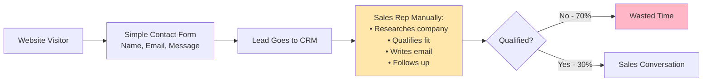
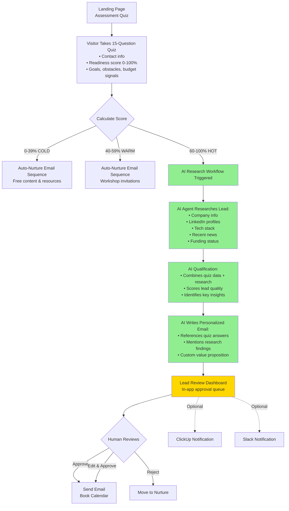
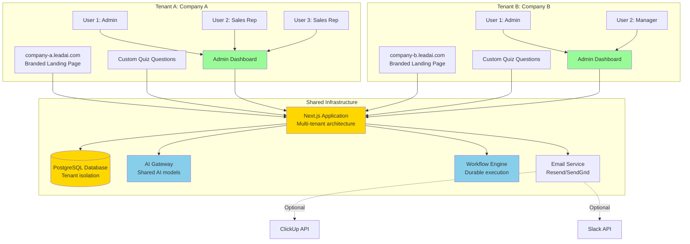
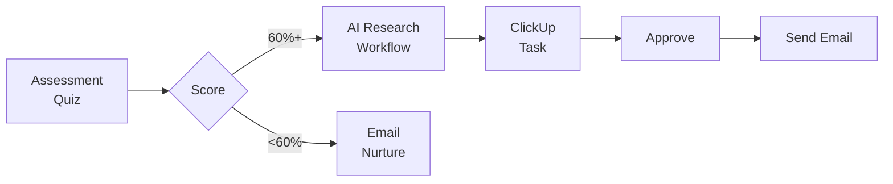
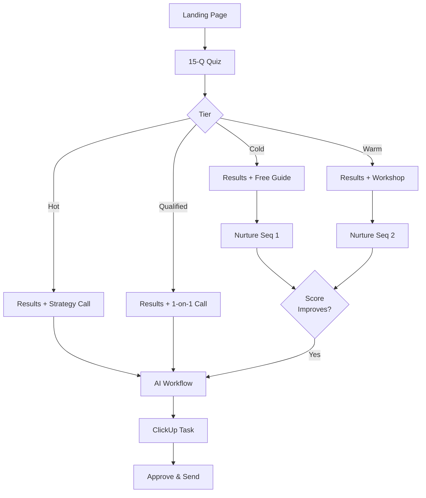

# AI-Powered Lead Qualification System
## Business Proposal & Product Vision

**Date:** November 2, 2025
**Status:** New Project Proposal
**Opportunity:** Multi-tenant SaaS product for automated lead qualification

---

## Executive Summary

We have an opportunity to build an **AI-powered lead qualification system** that automates the entire process from website visitor to qualified sales conversation. This isn't just a tool for us—it's a product we can sell to other businesses.

**The Market Opportunity:**
- Every B2B company struggles with lead quality vs. quantity
- Sales teams waste 60-70% of their time on unqualified leads
- Marketing generates leads, but doesn't know who's actually ready to buy
- Assessment-based lead generation is proven (20-40% conversion vs. 5-15% for simple forms)

**What We're Building:**
A **multi-tenant, multi-user SaaS platform** that combines proven assessment methodology with AI-powered research to automatically qualify, research, and personalize outreach for every lead—enabling sales teams to collaborate on lead approval and follow-up.

**Business Model:**
- **For us:** Use it to generate qualified leads for our own business
- **For others:** License as multi-tenant SaaS ($299-999/month per company)
- **Target market:** B2B service businesses, coaching, consulting, education, SaaS companies

---

## The Problem (That Every Business Has)

### Traditional Lead Capture Fails

**The Pain Points:**
- ❌ No pre-qualification—sales wastes time on bad fits
- ❌ Manual research is slow and inconsistent
- ❌ Generic outreach gets ignored (not personalized)
- ❌ No visibility into lead quality until sales touches them
- ❌ Cold leads with potential are abandoned (no nurture system)

---

## Our Solution: The AI Lead Qualification System

### What It Does

Automatically transforms website visitors into qualified, researched, personalized sales opportunities.

### The System Components

**1. Smart Assessment Quiz**
- Engaging landing page with proven conversion copy (20-40% start rate)
- 15 questions that capture contact info + calculate readiness score
- Questions reveal: skills, goals, obstacles, timeline, budget signals
- 70%+ completion rate (vs. 30% for long forms)

**2. AI Research Engine**
- Only activates for qualified leads (60%+ score = saves money)
- Autonomous AI agent with multiple tools:
  - Web search (Exa.ai)
  - Company data lookup
  - LinkedIn research
  - Tech stack analysis
  - Knowledge base querying
- Produces comprehensive research report in minutes

**3. AI Qualification & Personalization**
- Combines quiz responses + research findings
- Generates composite lead score
- Writes personalized email that references:
  - Specific quiz answers ("You mentioned struggling with X...")
  - Research insights ("I saw your company just raised Series A...")
  - Custom solution fit

**4. Built-in Review & Approval Dashboard**
- Native approval interface (no external tools required)
- Sales team reviews in-app:
  - Lead score and tier
  - Quiz responses
  - Research summary
  - Edit email draft directly
  - Approve/Reject/Revise buttons
- Optional integrations: ClickUp, Slack notifications
- Approved emails send automatically

**5. Automated Nurture Tracks**
- Cold/Warm leads enter email sequences
- Content tailored to their tier
- "Retake assessment" links to track progress
- When score improves → triggers AI workflow

---

## Product Architecture

### Multi-Tenant, Multi-User Architecture

**Multi-Tenant Architecture:**
- Complete data isolation between organizations (tenant_id on all records)
- Each tenant gets their own branded subdomain (company-name.leadai.com)
- Custom domain support (leads.company.com)
- Separate database schemas or row-level security
- Independent billing and usage limits per tenant
- Custom branding (logo, colors, fonts) per tenant
- Customizable quiz questions and email templates per tenant

**Multi-User Capabilities:**
- Unlimited users per tenant (based on plan)
- Role-based access control (Admin, Manager, Sales Rep, Viewer)
- Team collaboration features (assignments, activity logs, comments)
- User permissions (who can approve, edit, export, manage settings)
- Lead assignment rules (round-robin, manual, by tier)
- Individual user activity tracking and audit logs

---

## Why This Will Sell

### Target Customers

**Ideal Customer Profile:**
- B2B service businesses (coaching, consulting, agencies)
- Online course creators and education businesses
- SaaS companies with complex sales cycles
- Professional service firms (legal, accounting, HR)

**Their Pain:**
- Get 500-5,000 website visitors per month
- Convert <5% to leads
- Sales team spends hours researching and qualifying
- Most leads are tire-kickers, not buyers
- No systematic way to nurture cold leads

**What They'll Pay For:**
- 10x increase in lead capture rate (assessment converts better)
- Pre-qualified leads only (save sales time)
- Automated research (no manual LinkedIn stalking)
- Personalized outreach at scale
- Nurture system for cold leads (build email list asset)

### Competitive Advantage

**vs. Simple Lead Forms (Typeform, Google Forms):**
- ✅ We have AI research + qualification
- ✅ We have automated nurture
- ✅ We have built-in approval workflow (they just collect data)

**vs. Marketing Automation (HubSpot, ActiveCampaign):**
- ✅ We have assessment-based capture (higher conversion)
- ✅ We have AI research engine (they don't)
- ✅ We're simpler to set up (purpose-built for one thing)
- ✅ Built-in approval UI (don't need separate CRM)

**vs. AI Research Tools (Clay, Instantly):**
- ✅ We have assessment qualification (not just emails from lists)
- ✅ We're end-to-end (landing page → qualified convo)
- ✅ We have built-in human approval workflow (they're send-only)

**vs. ScoreApp (Assessment Platform):**
- ✅ We have AI research integration (they're just quiz)
- ✅ We have ClickUp workflow (they just email results)
- ✅ We can white-label for agencies

---

## Business Model

### Pricing Tiers

**Starter - $299/month**
- 500 quiz completions/month
- 100 AI research workflows/month
- Built-in approval dashboard
- 3 team members
- Email nurture sequences (basic)
- Custom branding (subdomain)

**Professional - $599/month**
- 2,000 quiz completions/month
- 500 AI research workflows/month
- Built-in approval dashboard
- 10 team members
- ClickUp & Slack integrations
- Advanced email automation
- Custom domain
- A/B testing for landing page

**Enterprise - $999/month**
- Unlimited quiz completions
- 2,000 AI research workflows/month
- Built-in approval dashboard
- Unlimited team members
- All integrations (ClickUp, Slack, webhooks, Zapier)
- White-label (remove our branding)
- API access
- Dedicated success manager

**Add-ons:**
- Additional AI research: $2 per workflow
- Additional team members: $49/month per user
- Custom integrations: $199 setup

### Revenue Projections

**Conservative (Year 1):**
- 10 customers × $599/month avg = $5,990/month
- Annual: $71,880

**Moderate (Year 2):**
- 50 customers × $599/month avg = $29,950/month
- Annual: $359,400

**Aggressive (Year 3):**
- 200 customers × $649/month avg = $129,800/month
- Annual: $1,557,600

### Cost Structure

**Fixed Costs (Monthly):**
- Hosting (Vercel): $200
- Database (Neon PostgreSQL): $100
- Email service (Resend): $100
- Monitoring & analytics: $50
- **Total: ~$450/month**

**Variable Costs (Per Customer):**
- AI Gateway (research workflows): ~$0.50-2.00 per workflow
- Email sends: ~$0.001 per email
- Storage: negligible with proper data retention

**Margins:**
- Starter: ~85% gross margin
- Professional: ~88% gross margin
- Enterprise: ~90% gross margin

---

## Technical Implementation

### Phase 1: MVP for Ourselves (4-6 weeks)

**Week 1-2: Core System**
- ✅ Landing page with assessment quiz (15 questions)
- ✅ Scoring algorithm (0-100% readiness score)
- ✅ Database schema (leads, quiz responses, workflows)
- ✅ Basic UI with our branding

**Week 3-4: AI Workflow & Approval**
- ✅ AI research agent with tools (search, fetch, analyze)
- ✅ Qualification logic (quiz score + research)
- ✅ Email generation (personalized templates)
- ✅ Built-in review dashboard (approve/edit/reject)
- ✅ Email sending on approval

**Week 5-6: Automation & Testing**
- ✅ Email nurture sequences (cold/warm)
- ✅ Results page (show score + insights)
- ✅ End-to-end testing
- ✅ Launch for our business

**Outcome:** Working system generating qualified leads for us

### Phase 2: Multi-Tenant, Multi-User SaaS (6-8 weeks)

**Week 7-8: Multi-Tenancy & User Management**
- Tenant/organization management (create, configure, delete)
- User authentication and authorization (tenant-scoped)
- Subdomain routing (tenant-a.leadai.com)
- Complete data isolation (tenant_id on all tables)
- Row-level security policies
- User invitation system (email invites with role assignment)
- Role-based permissions (RBAC)
- Billing integration (Stripe, per-tenant subscriptions)

**Week 9-10: Customization & Integrations**
- Quiz question editor (clients customize questions)
- Email template editor
- Branding customization (logo, colors, domain)
- Team management (invite users, set permissions)
- Optional: ClickUp integration (webhook notifications)
- Optional: Slack integration (new lead alerts)

**Week 11-12: Admin, Team Management & Onboarding**
- Admin dashboard (leads, analytics, team overview)
- Team management UI (invite users, set roles, manage permissions)
- User profile management (each user manages their own settings)
- Organization settings (branding, quiz config, integrations)
- Onboarding flow (setup wizard: create org, invite team, customize quiz)
- Usage tracking and billing dashboard
- Documentation and help center

**Week 13-14: Beta Testing**
- Invite 5 pilot customers (free/discounted)
- Gather feedback
- Iterate and improve
- Prepare for public launch

**Outcome:** Multi-tenant SaaS ready for paying customers

### Tech Stack

**Already Built (Current Project):**
- ✅ Next.js 16 (framework)
- ✅ AI SDK with Workflow DevKit (AI + durable execution)
- ✅ PostgreSQL via NeonDB (database)
- ✅ Vercel AI Gateway (AI model access)
- ✅ Exa.ai (web search)
- ✅ Form handling with validation
- ✅ Email basics

**Need to Add:**
- **Multi-tenant architecture:**
  - Tenant management (organization creation, settings)
  - Complete data isolation (tenant_id everywhere)
  - Subdomain and custom domain routing
  - Per-tenant customization (branding, quiz, emails)
- **Multi-user system:**
  - User authentication (tenant-scoped logins)
  - User management (invite, remove, role assignment)
  - Role-based access control (Admin, Manager, Sales, Viewer)
  - Team collaboration (assignments, comments, activity logs)
- **Approval dashboard:** Review queue, edit, approve/reject UI
- **Billing system:** Stripe integration, per-tenant subscriptions, usage tracking
- **Email automation:** Resend with multi-sequence support
- **Admin dashboard:** Leads management, analytics, team overview
- **Optional integrations:** ClickUp, Slack (notifications only)

---

## Go-to-Market Strategy

### Phase 1: Use It Ourselves (Month 1-3)

**Goals:**
- Generate 100+ qualified leads for our business
- Prove ROI (conversion rate, time saved)
- Create case study with real numbers
- Screenshot the system in action

**Metrics to Track:**
- Quiz start rate (goal: 25%+)
- Quiz completion rate (goal: 70%+)
- Lead distribution (cold/warm/hot)
- AI research quality (human approval rate)
- Sales conversion rate by tier

### Phase 2: Pilot Customers (Month 4-6)

**Target:**
- 5-10 pilot customers (people we know)
- Offer 50% off for 6 months
- Industries: coaching, consulting, education

**Requirements:**
- Minimum 1,000 monthly visitors
- Existing ClickUp users
- Willing to provide testimonial/case study
- Schedule weekly feedback calls

**Success Criteria:**
- 80% retention after 3 months
- 2+ success stories with metrics
- Product-market fit validation

### Phase 3: Public Launch (Month 7-9)

**Marketing Channels:**
1. **Content Marketing**
   - Blog: "How we 10x'd our lead quality with AI"
   - Video: Demo walkthrough
   - Comparison guides vs. competitors

2. **Partnerships**
   - ClickUp partner directory
   - Agency white-label partnerships
   - Affiliate program for consultants

3. **Paid Acquisition**
   - Google Ads: "lead qualification software"
   - LinkedIn Ads: B2B service businesses
   - Retargeting: website visitors

4. **Product Hunt Launch**
   - Timed with feature milestone
   - Founder story angle
   - Lifetime deal for early supporters

**Target:**
- 20 paying customers by end of Month 9
- $12,000 MRR
- 90%+ NPS score

---

## Two Approaches to Build This

### Option 1: Smart Pre-Qualification Pipeline (Faster)

**What We Build:**

**Focus:**
- Landing page + 15-question quiz
- Tier-based routing (hot leads → AI, cold leads → nurture)
- AI research only for qualified prospects
- ClickUp integration for approval
- Basic email nurture for cold/warm

**Timeline:** 4-6 weeks to MVP
**Best for:** Validating concept quickly, lower initial costs
**What we prove:** Does assessment convert better? Do quiz questions predict good leads?

---

### Option 2: Complete Multi-Touch Funnel (Comprehensive)

**What We Build:**

**Focus:**
- Professional landing page with A/B testing
- Dynamic results pages (4 different tiers)
- Sophisticated email nurture (4 sequences)
- AI workflow for hot/qualified only
- "Retake quiz" progression tracking
- Full admin dashboard
- Analytics and reporting

**Timeline:** 10-12 weeks to MVP
**Best for:** Building complete SaaS product from start
**What we get:** Full-featured product ready to sell, max lead capture

---

## Side-by-Side Comparison

| Feature | Option 1: Pipeline | Option 2: Complete |
|---------|-------------------|-------------------|
| **Time to launch** | 4-6 weeks | 10-12 weeks |
| **Initial cost** | Lower | Higher |
| **Lead capture** | Hot/qualified only | All tiers |
| **Email automation** | Basic (1-2 sequences) | Advanced (4+ sequences) |
| **Results pages** | Simple, generic | Dynamic, personalized |
| **Admin dashboard** | Minimal | Full-featured |
| **Ready to sell?** | No (need refinement) | Yes (complete product) |
| **Best for** | Validation | SaaS launch |
| **Risk** | Lower | Medium |
| **Revenue potential** | $5-10k MRR (Year 1) | $30-50k MRR (Year 1) |

---

## Recommendation

### Start with Option 1, Evolve to Option 2

**Months 1-3: Build Option 1 for Ourselves**
- Validate assessment converts better than forms
- Test quiz questions (which ones predict conversions?)
- Prove AI research quality (approval rate >80%?)
- Measure ROI for our business
- Create screenshots and case study

**Months 4-6: Enhance to Option 2**
- Add sophisticated nurture sequences
- Build dynamic results pages
- Create admin dashboard
- Add analytics and reporting
- Polish for selling

**Months 7-9: Launch as Multi-Tenant SaaS**
- Add tenant management
- Billing integration
- Onboarding flow
- Customer success tools
- Public launch

**Why this path?**
- ✅ Lower risk (prove concept first)
- ✅ Real data guides decisions (don't guess what customers need)
- ✅ Cash flow positive from our business first
- ✅ Better product (we're actual users, understand pain)
- ✅ Credibility (case study from own use)

---

## Investment & Returns

### What We Need to Build This

**Time Investment:**
- Development: 4-6 weeks for Option 1 (can work on existing project)
- Then 6-8 weeks to make it multi-tenant
- **Total: 10-14 weeks to SaaS product**

**Financial Investment:**
- Development costs: $0 (we build it)
- Infrastructure (Months 1-6): ~$500/month
- Tools (AI Gateway, Exa, Email): ~$200/month
- Marketing (pilot phase): ~$1,000/month
- **Total Year 1: ~$20,000**

### Expected Returns

**Year 1 (Conservative):**
- Our business: 100 qualified leads → 10 customers → $50,000 revenue
- SaaS (10 customers × $599 avg): $71,880/year
- **Total: $121,880**
- **ROI: 6x**

**Year 2 (Moderate):**
- Our business: $100,000 revenue
- SaaS (50 customers): $359,400/year
- **Total: $459,400**

**Year 3 (Aggressive):**
- Our business: $150,000 revenue
- SaaS (200 customers): $1,557,600/year
- **Total: $1,707,600**

---

## Risk Analysis

### Risks & Mitigation

**Risk 1: Assessment doesn't convert better**
- *Mitigation:* Industry benchmarks are 20-40% (vs. 5-15% forms)
- *Plan B:* Use for email capture only, focus on AI research value

**Risk 2: AI research quality is poor**
- *Mitigation:* Human approval in ClickUp catches issues
- *Plan B:* Use AI for research only, human writes email

**Risk 3: No one wants to buy it**
- *Mitigation:* Use it ourselves first (not wasted even if no SaaS)
- *Plan B:* Agency service (we run it for clients)

**Risk 4: Users want specific integrations**
- *Mitigation:* Built-in approval dashboard works standalone (no integration needed)
- *Plan B:* ClickUp/Slack are optional add-ons, not required features

**Risk 5: Too expensive to operate**
- *Mitigation:* Only research qualified leads (60%+ score)
- *Plan B:* Charge per research workflow if needed

---

## Success Metrics

### Phase 1: Validation (Our Business)

- [ ] Quiz start rate ≥ 20%
- [ ] Quiz completion rate ≥ 65%
- [ ] AI approval rate ≥ 75% (ClickUp)
- [ ] Qualified lead volume +200%
- [ ] Sales close rate +50% (better quality)

### Phase 2: Pilot Customers

- [ ] 5 pilot customers signed
- [ ] 80% retention after 3 months
- [ ] Average NPS score ≥ 50
- [ ] 2+ case studies with metrics
- [ ] Feature requests prioritized

### Phase 3: SaaS Launch

- [ ] 20 paying customers
- [ ] $12,000 MRR
- [ ] <5% churn rate
- [ ] CAC < $500
- [ ] LTV > $10,000

---

## Next Steps

### Decision Time

**Questions to Answer:**
1. Do we want to build this as a SaaS product (not just for us)?
2. Option 1 (fast) or Option 2 (comprehensive) to start?
3. Do we build the approval dashboard first, or add integrations later?
4. What's our timeline? (Start now? Wait until...?)
5. Who's building this? (In-house, contractors, hybrid?)

### If We Go Forward

**This Week:**
- [ ] Decide Option 1 vs. Option 2
- [ ] Set project timeline
- [ ] Allocate development resources
- [ ] Define multi-tenant architecture approach (subdomain routing, data isolation)
- [ ] Design user role/permission model
- [ ] Draft quiz questions (customize for our business)

**Next 2 Weeks:**
- [ ] Design landing page (hook, value prop, CTA)
- [ ] Build quiz interface
- [ ] Create database schema
- [ ] Research ClickUp API (authentication, task creation)

**Weeks 3-4:**
- [ ] Build AI research workflow
- [ ] Build approval dashboard (review, edit, approve/reject UI)
- [ ] Email templates and nurture logic
- [ ] End-to-end testing

**Weeks 5-6:**
- [ ] Soft launch (10% of traffic)
- [ ] Analyze data
- [ ] Optimize and iterate
- [ ] Full launch

---

## Appendix: Technical Details

### Built-in Approval Dashboard

**Core Features:**
- Queue of pending leads (sortable by score, date, tier)
- Lead detail view with tabs:
  - **Overview:** Score, tier, contact info
  - **Quiz Responses:** All 15 answers with context
  - **Research Report:** AI findings (expandable sections)
  - **Email Draft:** Editable email with live preview
- Action buttons:
  - **Approve & Send** (green)
  - **Edit & Approve** (opens editor)
  - **Request Revision** (sends back to AI with notes)
  - **Reject & Nurture** (moves to email sequence)
  - **Assign to Team Member**

**Multi-User Team Collaboration:**

**User Roles & Permissions:**
- **Admin** - Full access: manage users, settings, billing, approve leads
- **Manager** - View all leads, analytics, assign leads, cannot manage billing
- **Sales Rep** - Review/approve assigned leads, view own activity
- **Viewer** - Read-only access to leads and reports

**Assignment Features:**
- Automatic assignment (round-robin distribution to sales reps)
- Manual assignment (admin assigns specific leads to reps)
- Tier-based assignment (hot leads to senior reps, warm to junior)
- Load balancing (equal distribution based on current workload)

**Collaboration Tools:**
- Lead commenting (team discussion on specific leads)
- Activity log (complete audit trail: who did what, when)
- @mentions (notify team members in comments)
- Lead transfer (reassign to different team member)
- Shared notes (team-wide context on lead)

**Notifications:**
- Real-time browser notifications (new lead assigned to you)
- Email notifications (daily digest of pending leads)
- Mobile push notifications (urgent high-score leads)
- Slack/ClickUp integration (optional team alerts)

**Mobile Responsive:**
- Review and approve from phone
- Swipe actions (approve/reject)
- Push notifications for urgent leads

### Optional Integrations (Phase 2)

**ClickUp Integration:**
- Send notification to ClickUp when lead needs review
- Create task with link back to our dashboard
- Update task status when approved/rejected in our system

**Slack Integration:**
- Post to channel when new qualified lead arrives
- Include lead score, company, and "Review Now" button
- Thread updates when status changes

**Webhook System:**
- Allow clients to configure custom webhooks
- POST lead data to their systems (Zapier, Make, custom apps)
- Useful for CRM integrations (Salesforce, HubSpot, Pipedrive)

### Database Schema (High-Level)

**Core Multi-Tenant Tables:**

**tenants**
- id (UUID, primary key)
- name (organization name)
- subdomain (unique, company-name.leadai.com)
- custom_domain (optional, leads.company.com)
- branding (JSON: logo, colors, fonts)
- settings (JSON: quiz config, email templates)
- subscription_tier (starter/pro/enterprise)
- subscription_status (active/canceled/suspended)
- usage_limits (JSON: monthly quotas)
- created_at, updated_at

**users**
- id (UUID, primary key)
- tenant_id (FK to tenants - multi-tenant isolation)
- email (unique within tenant)
- name
- role (admin/manager/sales/viewer)
- permissions (JSON: granular permissions)
- last_login_at
- created_at, updated_at

**leads**
- id (UUID, primary key)
- tenant_id (FK to tenants - multi-tenant isolation)
- contact_info (JSON: name, email, phone)
- quiz_responses (JSON: all 15 answers)
- readiness_score (0-100)
- lead_score (0-100)
- tier (cold/warm/hot/qualified)
- assigned_to_user_id (FK to users - multi-user assignment)
- created_at, updated_at

**workflows**
- id (UUID, primary key)
- tenant_id (FK to tenants - multi-tenant isolation)
- lead_id (FK to leads)
- research_report (text)
- email_draft (text)
- status (pending/approved/rejected/sent)
- reviewed_by_user_id (FK to users - multi-user tracking)
- reviewed_at
- created_at, updated_at

**activity_logs**
- id (UUID, primary key)
- tenant_id (FK to tenants - multi-tenant isolation)
- user_id (FK to users - multi-user audit)
- lead_id (FK to leads)
- action (created/reviewed/approved/rejected/edited)
- details (JSON: what changed)
- created_at

**team_assignments**
- id (UUID, primary key)
- tenant_id (FK to tenants)
- lead_id (FK to leads)
- user_id (FK to users)
- assigned_by_user_id (FK to users)
- assigned_at

**email_sequences**
- id (UUID, primary key)
- tenant_id (FK to tenants - per-tenant templates)
- tier (cold/warm/hot)
- sequence_number (1, 2, 3...)
- template (text with variables)
- delay_days (0, 1, 3, 7...)

**Key Multi-Tenant Patterns:**
- Every table has `tenant_id` for complete isolation
- Row-Level Security (RLS) policies enforce tenant boundaries
- Users can only see data for their tenant
- Subdomain routing determines which tenant context to use

---

**Ready to discuss? Let's talk through whether this feels like the right opportunity and which approach makes sense for our goals.**
